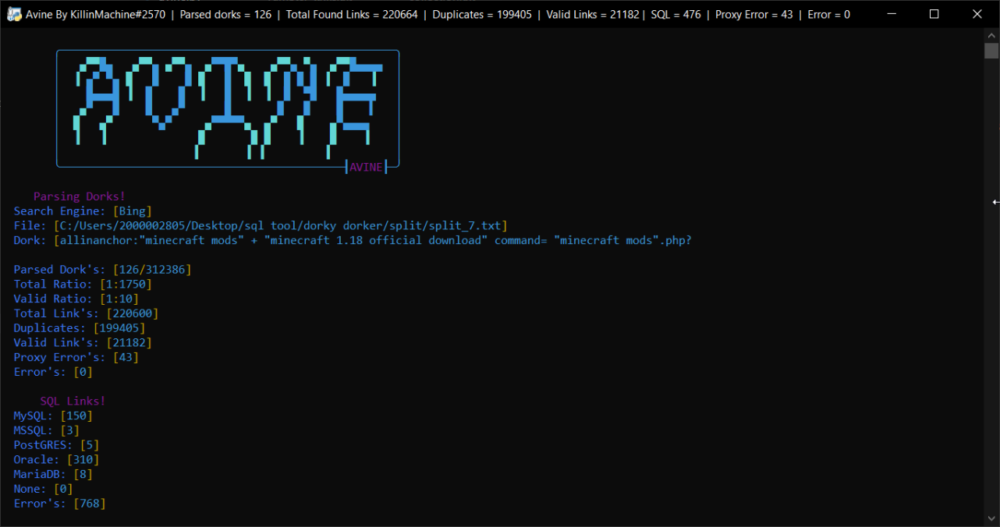
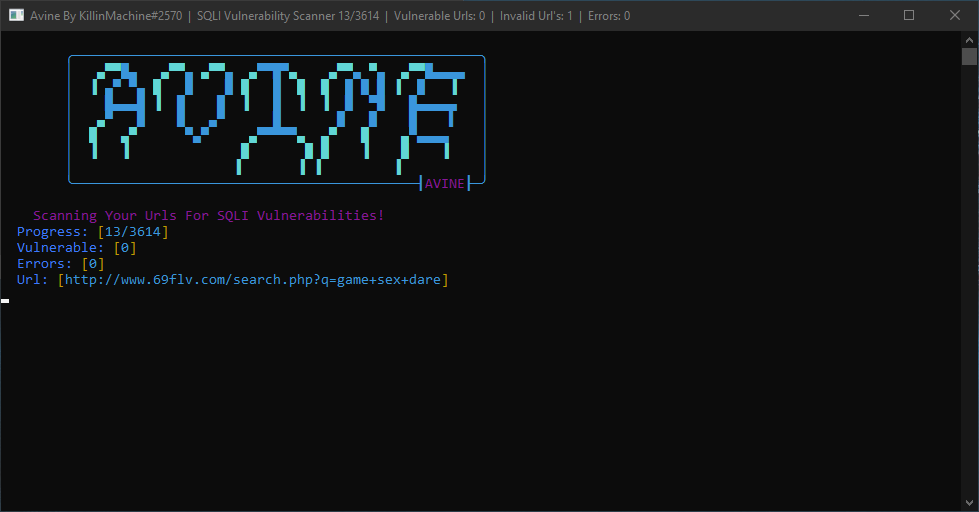
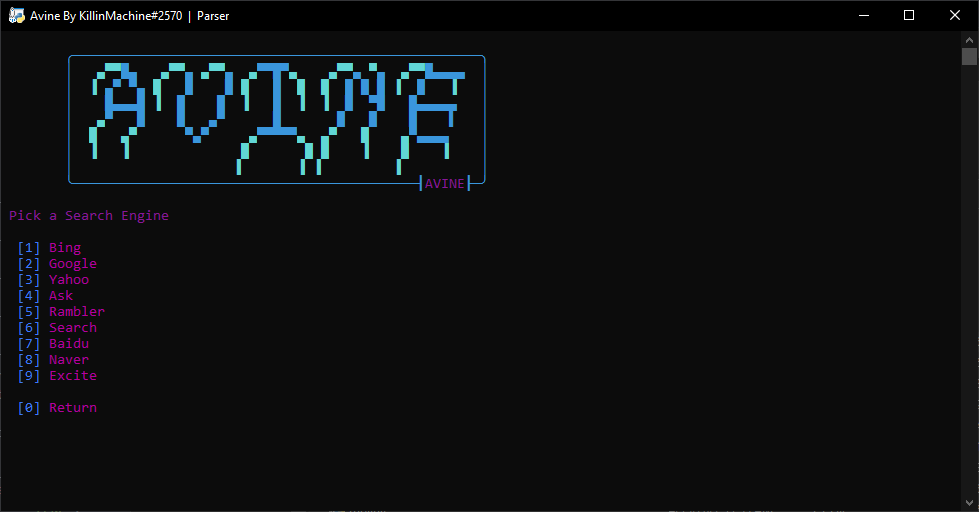
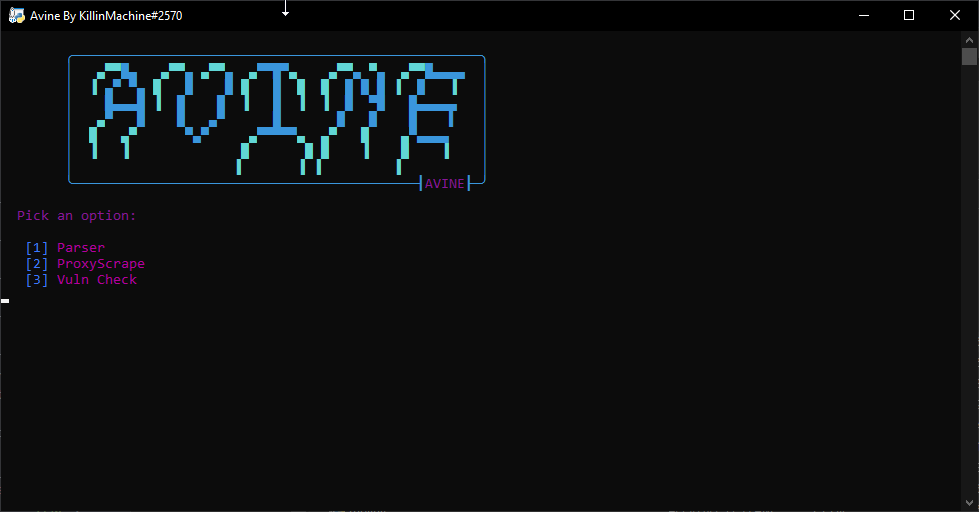
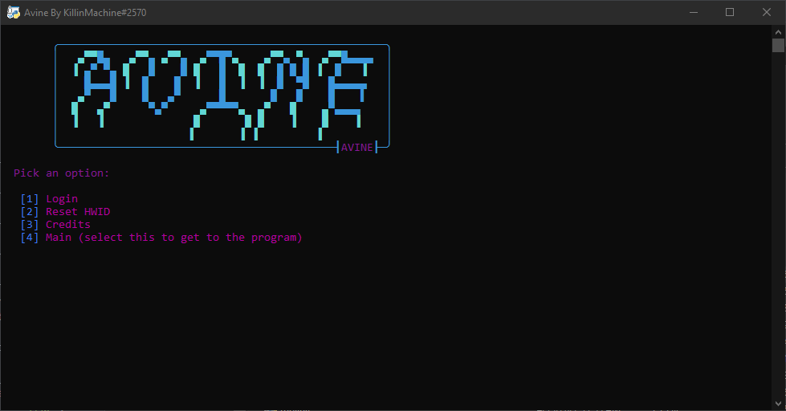

# Avine
Avine is an unfinished sql/dorking tool I made in python. A lot of things I never finished because I'm making a csharp version. If anyone is interesting in contributing to avine message me on discord: KillinMachine#2570. There will not be any updates as of now. The vulnerability Does not work. Some engines of the dork parser do work. I just wanted to release this for people to use if they really need something and to learn how it works. Excuse my messy code and some questionable ways I did things. 

### Download exe [Here](https://github.com/MachineKillin/Avine/releases/download/v1.0.1/avine.zip)

## About
Avine is a python Dork Parser with a proxy scraper and sql/lfi scanner. Scanners do not work but can be fixed. This program was going to be sold thats why theres a login screen. I did not want to sell the python version due to it being slow. **Please do give credit if you use my code anywhere!**

## Help
For help join my discord server [Avine Discord](https://discord.gg/bFUKufJp6X) or [Github Discord](https://discord.com/invite/JcAvQc797r)

## Installing
```
git clone https://github.com/MachineKillin/Avine
cd avine
pip install -r requirements.txt
python3 avine.py
```

## Pictures





